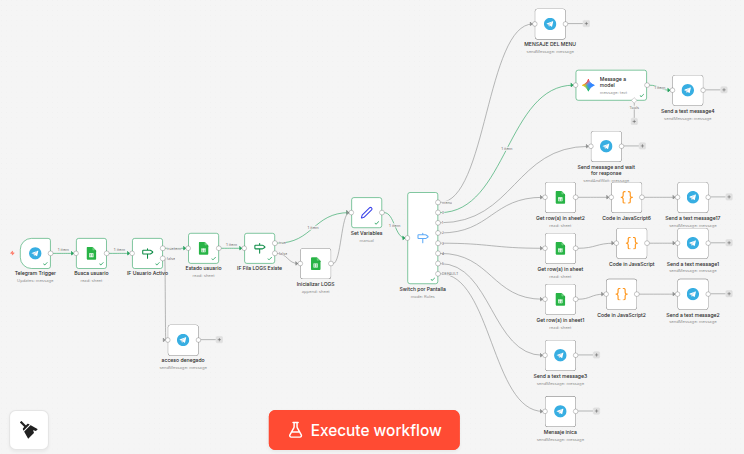

# HelpDeskBot 
**Sistema Automatizado de Soporte Técnico y Gestión de Solicitudes**

---

**Solución de automatización construida en n8n para gestionar tickets de soporte de manera eficiente. Centraliza la comunicación vía Telegram y mantiene un registro estructurado en Google Sheets para auditoría y resolución.**

**2026 — Proyecto n8n Community Edition + Google Cloud API**

---

##  Descripción General

**HelpDeskBot** es un sistema de gestión de tickets que reemplaza el registro manual por un flujo de trabajo automatizado y en tiempo real. Permite a los usuarios internos reportar incidentes y consultar estados directamente desde Telegram.

- **Validación de Usuario:** Verifica que el solicitante esté activo en la base de datos.
- **Flujo Multi-paso:** Creación guiada de tickets (Tipo, Prioridad, Descripción).
- **Consulta Dinámica:** Seguimiento de tickets existentes por ID o lista personal.
- **Auditoría Automática (Logs):** Registro de cada interacción para trazabilidad.
- **Persistencia en la Nube:** Base de datos centralizada en Google Sheets.

---

##  Tecnologías Utilizadas

| Capa | Tecnología |
|------|------------|
| **Orquestador** | n8n Community Edition |
| **Interfaz (Bot)** | Telegram Bot API |
| **Persistencia** | Google Sheets API |
| **Lógica** | JavaScript (n8n Code Nodes) |
| **Formato** | JSON Importable |

---

##  Estructura de la Base de Datos

El sistema utiliza un archivo de Google Sheets llamado `HelpDeskBot_DB_MG` con la siguiente estructura obligatoria:

### 1. Hoja: SOLICITUDES
| Columna | Descripción |
|---------|-------------|
| `id_ticket` | ID único generado (Ej: TK-7A2B) |
| `tipo` | Categoría del soporte |
| `prioridad` | Nivel de urgencia |
| `estado` | Estado actual (Abierto/Cerrado) |
| `creado_por` | ID de Telegram del usuario |

### 2. Hoja: USUARIOS
| Columna | Descripción |
|---------|-------------|
| `telegram_user` | ID único de Telegram |
| `nombre` | Nombre del empleado |
| `activo` | Estado de acceso (TRUE/FALSE) |

### 3. Hoja: LOGS
| Columna | Descripción |
|---------|-------------|
| `timestamp` | Fecha y hora del evento |
| `telegram_user`| Usuario que interactuó |
| `pantalla` | Menú o módulo accedido |

---

##  Estructura del Workflow (Nodos)

La lógica del archivo `.json` está organizada en los siguientes bloques:

- **Telegram Trigger:** Detecta mensajes entrantes y arranca la ejecución.
- **Validación (IF):** Filtra usuarios activos mediante una búsqueda en la hoja `USUARIOS`.
- **Switch Menu:** Enruta al usuario según su elección (Ayuda, Crear, Consultar, Listar).
- **Code Nodes (JS):** Generan IDs únicos y formatean datos para las respuestas de Telegram.
- **Google Sheets Nodes:** Realizan operaciones de *Lookup* para consultas y *Append* para registros y logs.
- **Telegram Send:** Envía confirmaciones visuales con emojis y formato Markdown.
- **Claude API:** Personaliza mensajes para luego ser enviados con Telegram Send.

---

##  Instalación y Ejecución

### 1. Requisitos Previos
- Instancia de **n8n** activa (Local, Cloud o Docker).
- **Telegram Bot API Token** (Obtenido vía [@BotFather](https://t.me/botfather)).
- **Google Cloud Console:** Credenciales OAuth2 para la API de Google Sheets.

### 2. Cómo Instalar el Workflow
1. Descarga el archivo `n8n-MG.json`.
2. En tu lienzo de n8n, presiona `Ctrl + V` o usa la opción **Import from File**.
3. **Configura las credenciales:**
   - Haz clic en el nodo de Telegram y selecciona tus credenciales.
   - Haz clic en los nodos de Google Sheets y conecta tu cuenta.
4. Vincula el **Sheet ID** de tu archivo `HelpDeskBot_DB` en los parámetros de cada nodo de Google Sheets.

---

##  Roles y Permisos

| Acción | Usuario Activo | Usuario Inactivo |
|--------|----------------|------------------|
| Acceso al Menú | ✅ | ❌ |
| Crear Ticket | ✅ | ❌ |
| Consultar Status | ✅ | ❌ |
| Registro de Logs | ✅ | ❌ |

---

##  Autor

**Desarrollado para HelpDeskBot S.A. • 2026**

**Proyecto de Automatización por Maria Alejandra Gomez Archila**

